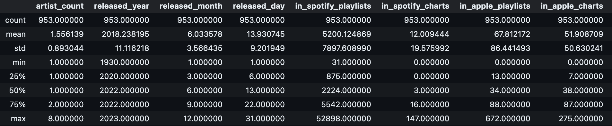
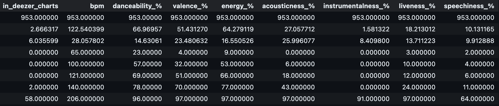
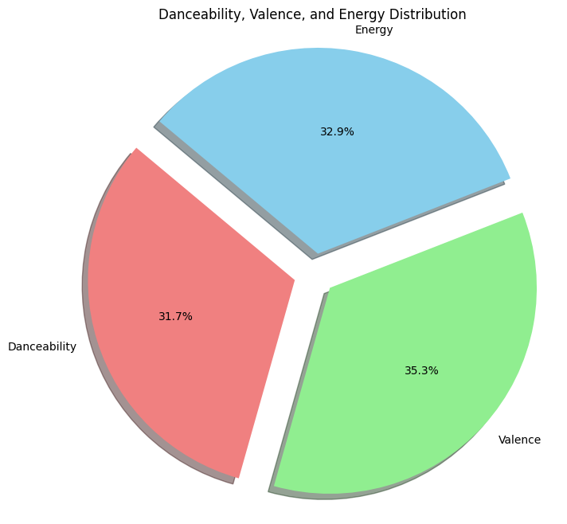
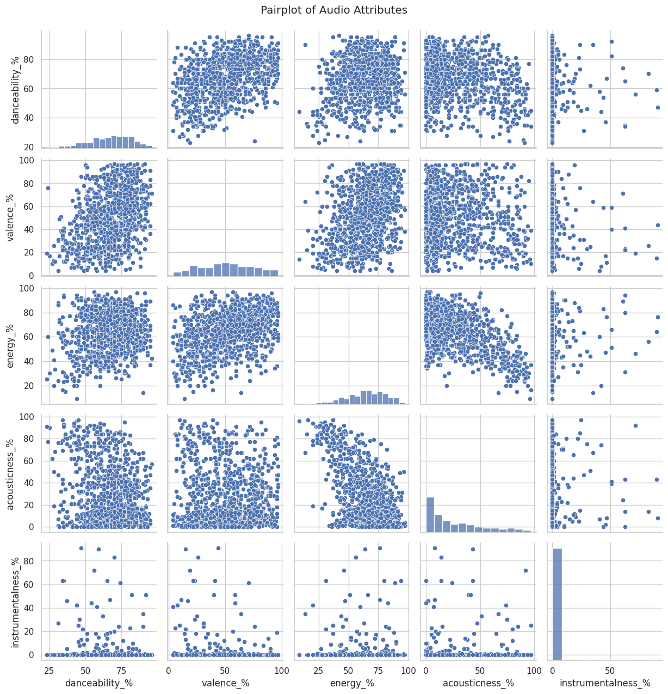

## Jiechen_Li_Individual_1

## Purpose 
🤔 To generate the descriptive statistics on datasets by using Pandas in both ``jupyther notebook (.ipynb)`` and ``lib.py`` files to read `` spotify_2023_1.csv ``.       
🤔 To use `nbval` plugin for pytest.
  * To test jupyther notebook file with `test_lib.py`  and ``test_script.py ``.
  * Format code with Python black. 
  * Lint code with `Ruff`.

The ``spotify_2023_1.csv `` is from: https://www.kaggle.com/datasets/nelgiriyewithana/top-spotify-songs-2023/code 

This dataset contains a comprehensive list of the most famous songs of 2023 as listed on Spotify. The dataset offers a wealth of features beyond what is typically available in similar datasets. It provides insights into each song's attributes, popularity, and presence on various music platforms. The dataset includes information such as track name, artist(s) name, release date, Spotify playlists and charts, streaming statistics, Apple Music presence, Deezer presence, Shazam charts, and various audio features.

### Files 

- ``.devcontainer`` configures local development container environment
- ``github/workflows/ci.yml`` triggers CI/CD on git push and pull request
- ``.gitignore`` specifies which files or directories should be excluded from version control when using Git
- ``Makefile`` build commands and utilities
- ``README.md`` instruction file for the readers
- ``requirements.txt`` specifies the dependencies (libraries and packages) required to run the project

### CI/CD

On git push/pull request the CI/CD flow is triggered using Github Actions:

1. Install and validate Rust toolchain
2. Format and lint code
3. Run unit tests
4. Build binary release
5. Lint Dockerfile
6. Build distroless rusty-ds image
7. Push image to [Github Container Registry](https://github.com/athletedecoded?tab=packages)

### Preparation
1. Open codespaces 
2. Wait for container to be built with requiremnts.txt installed

### Generate the Descriptive Statistics 

 

### Visualizations
``Danceability, Valence and Engergy Distribution`` 

``Pairplot of Audio Attributes``

### Summary Report
Please check ``Summary_Report.ipynb`` for details.

### Demo Video

